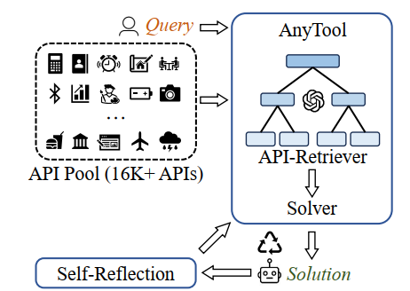

# AnyTool

<a href='https://arxiv.org/abs/2402.04253'></a>  <a href='https://github.com/dyabel/AnyTool/blob/public/LICENSE'></a>

This is the implementation of the paper [AnyTool: Self-Reflective, Hierarchical Agents for Large-Scale API Calls](https://arxiv.org/abs/2402.04253)


# 🔧 Installation
## ✅ Dependencies
Require Python 3.9+

## 🚀 Quick install 
```bash
pip install -r requirements.txt
```

# 🔆 Preparation

**OPENAI API config and the ToolBench key**

Fill your OpenAI GPT-4 API config and toolbench key into the config.py (see [config_example.py](./config_example.py) as an example). We use Azure OpenAI for all our experiments. You can modify it according to your own configuration. 

Fill out the [form](https://docs.google.com/forms/d/e/1FAIpQLSdqHypmYanWU8ZhuUcrEuM5eFB03WqaqYJzvKUxUe1HzUBB3A/viewform?usp=send_form) to get the toolbench key. If you want to use your own RapidAPI key, you can put your key in the rapidapi_key_list.json (see [rapidapi_key_list_example.json](./rapidapi_key_list_example.json) as an example)

**ToolBench**

Download the ToolBench data using the following link: [Google Drive](https://drive.google.com/drive/folders/1yBUQ732mPu-KclJnuQELEhtKakdXFc3J) or [Tsinghua Cloud](https://cloud.tsinghua.edu.cn/f/c9e50625743b40bfbe10/).

The file structure is as follows:
```
├── /data/
│  ├── /instruction/
│  ├── /answer/
│  ├── /toolenv/
│  ├── /retrieval/
│  ├── /test_instruction/
│  ├── /test_query_ids/
│  ├── /retrieval_test_query_ids/
│  ├── toolllama_G123_dfs_train.json
│  └── toolllama_G123_dfs_eval.json
├── /reproduction_data/
│  ├── /chatgpt_cot/
│  ├── /chatgpt_dfs/
│  ├── ...
│  └── /toolllama_dfs/
```

For more details, please refer to [ToolBench](https://github.com/OpenBMB/ToolBench).

**Prepare the API data**

You should prepare the ToolBench data first. Make sure you have the directory of data/toolenv/tools
```
export PYTHONPATH=./
python scripts/extract_api_details.py
python scripts/extract_category_tool_details.py
python scripts/extract_tool_database.py
```

**AnyToolBench**

Generation script
```
export PYTHONPATH=./
python scripts/anytoolbench_generation.py --output_path atb_data/anytoolbench_new.json
```

We provide sample data in [anytoolbench.json](./atb_data/anytoolbench.json) file.

The data look like
```json
"query": "Can you provide detailed information about \"The Incredible Hulk\" movie that was released in 2008, including its plot, genres, and how it's evaluated by audiences, and also tell me the current timezone for Los Angeles, USA?",
"final_answer": "The Incredible Hulk (2008) is about scientist Bruce Banner who searches for an antidote to his unbridled rage, the Hulk, but faces new foes when forced back to civilization. GENRES: Sci-Fi, Action, Adventure. AUDIENCE SCORE: 6.2/10. The current timezone for Los Angeles, USA, is America/Los_Angeles.",
"query_id": "1000006",
"gt_api_list": [
            {
                "category_name": "Movies",
                "tool_name": "Advanced Movie Search",
                "api_name": "Search by Name"
            },
            {
                "category_name": "Location",
                "tool_name": "Timezone By API-Ninjas",
                "api_name": "/v1/timezone"
            }
        ],

```


# 🚗 Run AnyTool

Experiment on ToolBench, take G1-I as an example.
```
export PYTHONPATH=./
python scripts/main.py --output_dir result/test_instruction/G1_instruction --query_path data/test_instruction/G1_instruction.json --max_api_number 64
```
Experiment on AnyToolBench
```
export PYTHONPATH=./
python scripts/main.py --output_dir result/anytoolbench --query_path anytoolbench.json -max_api_number 64
```

The pass rate can be found in the success_cnt.txt under the output directory.
# 📏 Experiment Results
Main results on the filtered ToolBench. We use pass rate defined in Eq 2 and illustrated in Figure 4(b) in our paper, as the metric. All results are reproduced. *: OpenAI’s text-embedding-ada-002; Ref.: reference; Avg.: average; SR: self-reflective.
| Model        | API Retriever        | Solver                     | Use Ref. APIs | G1 I (%) | G1 T (%) | G1 C (%) | G2 I (%) | G2 C (%) | G3 I (%) | Avg. (%) |
|--------------|----------------------|----------------------------|---------------|----------|----------|----------|----------|----------|----------|----------|
| ToolLLM      | OpenAI TE*           | ToolLLaMA w/ DFSDT         |               | 8.7      | 6.8      | 12.0     | 4.7      | 8.2      | 10.5     | 8.5      |
| ToolLLM      | ToolLLM's            | ToolLLaMA w/ DFSDT         |               | 28.4     | 26.3     | 38.4     | 21.5     | 15.1     | 7.7      | 22.9     |
| ToolLLM      | ToolLLM's            | GPT-4 w/ DFSDT             |               | 42.6     | 46.2     | 51.4     | 23.4     | 24.5     | 2.6      | 31.8     |
| ToolLLM      | None                 | ToolLLaMA w/ DFSDT         | ✓             | 29.4     | 31.8     | 37.1     | 19.6     | 22.4     | 13.2     | 25.6     |
| GPT-4        | None                 | GPT-4 w/ CoT               | ✓             | 31.3     | 34.8     | 47.1     | 27.1     | 34.7     | 2.6      | 29.6     |
| GPT-4        | None                 | GPT-4 w/ DFSDT             | ✓             | 36.5     | 49.2     | 51.4     | 38.3     | 39.8     | 18.4     | 38.9     |
| GPT-4        | Plain Agent          | GPT-4 w/ DFSDT             |               | 13.9     | 23.5     | 17.6     | 13.9     | 9.2      | 13.2     | 15.2     |
| GPT-4        | AutoGen-RAG          | GPT-4 w/ DFSDT             |               | 14.8     | 19.7     | 19.7     | 7.4      | 9.2      | 7.9      | 13.1     |
| GPT-3.5      | None                 | GPT-3.5 w/ CoT             | ✓             | 37.5     | 37.1     | 42.9     | 24.3     | 22.4     | 5.3      | 28.3     |
| GPT-3.5      | None                 | GPT-3.5 w/ DFSDT           | ✓             | 39.1     | 40.2     | 48.6     | 31.8     | 25.5     | 15.8     | 33.5     |
| AnyTool (Ours) | SR Agent           | SR GPT-4 w/ DFSDT          |               | 52.2     | 61.4     | 67.6     | 58.9     | 45.9     | 63.2     | 58.2     |

Results on our AnyToolBench. All models use
DFSDT implementation in the solver. SR: self-reflective;
PR: pass rate
| Method  | API Retriever | Solver   | PR (%) |
|---------|---------------|----------|--------|
| ToolLLM | ToolLLM’s     | ToolLLaMA | 18.9   |
| ToolLLM | ToolLLM’s     | GPT-4    | 36.6   |
| GPT-4   | Plain Agent   | GPT-4    | 14.0   |
| AnyTool (Ours) | SR Agent | SR GPT-4 | 73.8   |


# 👨‍🏫 Acknowledgement
This repo is built on [ToolBench](https://github.com/OpenBMB/ToolBench).

# 📑Citation
If you find this project is helpful for your research, consider citing our paper
```
@article{du2024anytool,
  title={AnyTool: Self-Reflective, Hierarchical Agents for Large-Scale API Calls},
  author={Du, Yu and Wei, Fangyun and Zhang, Hongyang},
  journal={arXiv preprint arXiv:2402.04253},
  year={2024}
}
```
